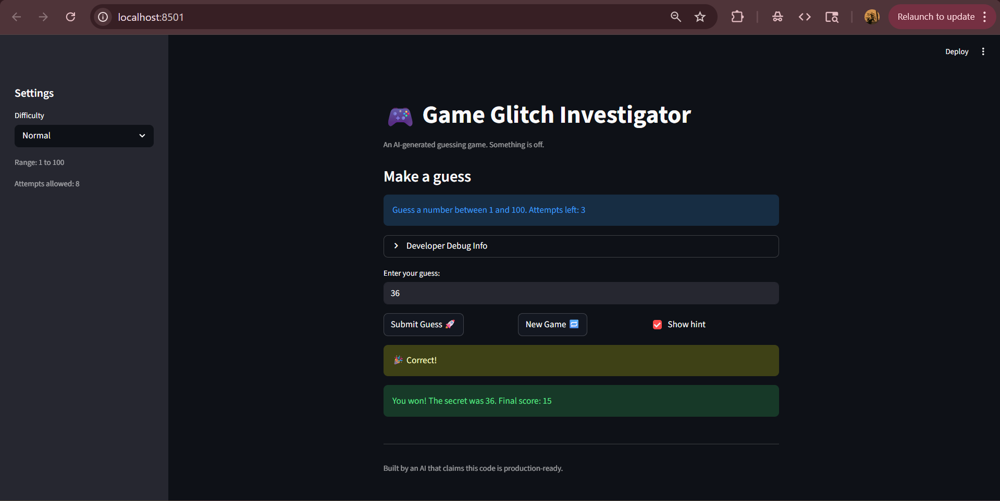

# 🎮 Game Glitch Investigator: The Impossible Guesser

## 🚨 The Situation

You asked an AI to build a simple "Number Guessing Game" using Streamlit.
It wrote the code, ran away, and now the game is unplayable. 

- You can't win.
- The hints lie to you.
- The secret number seems to have commitment issues.

## 🛠️ Setup

1. Install dependencies: `pip install -r requirements.txt`
2. Run the broken app: `python -m streamlit run app.py`

## 🕵️‍♂️ Your Mission

1. **Play the game.** Open the "Developer Debug Info" tab in the app to see the secret number. Try to win.
2. **Find the State Bug.** Why does the secret number change every time you click "Submit"? Ask ChatGPT: *"How do I keep a variable from resetting in Streamlit when I click a button?"*
3. **Fix the Logic.** The hints ("Higher/Lower") are wrong. Fix them.
4. **Refactor & Test.** - Move the logic into `logic_utils.py`.
   - Run `pytest` in your terminal.
   - Keep fixing until all tests pass!

## 📝 Document Your Experience

- [ ] Describe the game's purpose.
- [ ] Detail which bugs you found.
- [ ] Explain what fixes you applied.

The game's purpose is that it is an AI-generated guessing game where the player tries to guess a secret number within a limited number of attempts. Hints like "Go HIGHER!" or "Go LOWER!" help the player guess the correct secret number, and this helps them earn points based on their outcome. 

I found three bugs in this game. The first bug was that the hints were incorrect and misleading, for example, when I entered a lower number, the game would incorrectly tell me to "Go HIGHER!". The second bug was that the game did not end properly even after guessing the correct number or running out of attempts. The third bug was that the 'New Game' button did reset the attempts back to 8, however, the game did not allow me to resume playing again. 

I applied three fixes for each of the bugs in this game. The first fix was correcting the logic of the hints so that "Go HIGHER!" and "Go LOWER!" would be displayed when it matched the player's guess when compared to the secret number. The second fix was fixing the game-ending logic, where it properly checked the number of attempts that were left and set the status to won or lost. The third fix was updating the 'New Game' button to reset all the relevant session state variables such as attempts, score, history, and status so that a new game would start cleanly. 

## 📸 Demo

- [ ] [Insert a screenshot of your fixed, winning game here]

## 🚀 Stretch Features

- [ ] [If you choose to complete Challenge 4, insert a screenshot of your Enhanced Game UI here]
